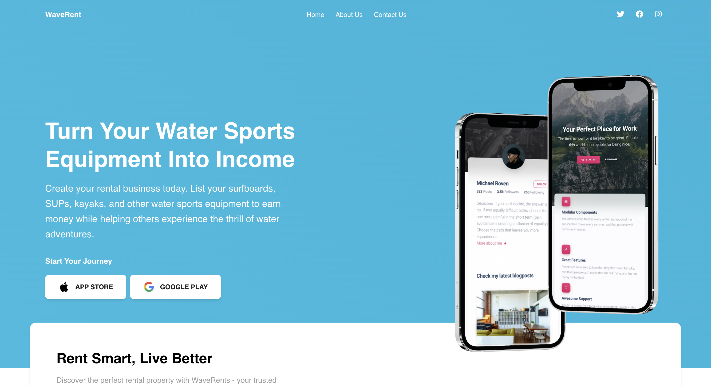

# WaveRent Landing Page



A modern landing page for WaveRent - a water sports equipment rental marketplace that connects equipment owners with renters.

## Features

- 🏄‍♂️ Modern, responsive design
- 🎨 Built with Next.js 13, TypeScript, and Tailwind CSS
- 📱 Mobile-first approach
- 🎯 Smooth scroll navigation
- 💫 Interactive UI components
- 🔍 SEO optimized

## Getting Started

### Prerequisites

- Node.js 16.8 or later
- npm or yarn package manager

### Installation

1. Clone the repository:
```bash
git clone https://github.com/yourusername/waverents-landing.git
cd waverents-landing
npm install
# or
yarn install

npm run dev
# or
yarn dev
```

Project Structure

waverents-landing/
├── public/
│   ├── image/
│   └── logos/
├── src/
│   ├── app/
│   │   ├── page.tsx
│   │   ├── hero.tsx
│   │   └── ...
│   └── components/
│       ├── navbar.tsx
│       ├── footer.tsx
│       └── ...
├── package.json
└── README.md